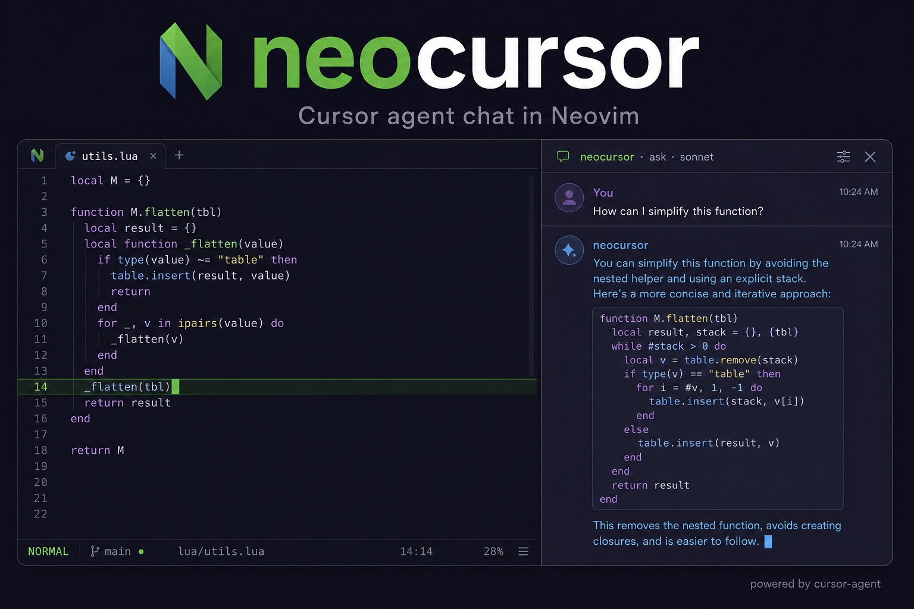

# neocursor

A Cursor-style agent chat panel for **Neovim**, powered by the
[`cursor-agent`](https://cursor.com/cli) CLI.

Open a sidebar, ask questions about your code, and watch the answer stream in —
just like Cursor's chat, but inside Neovim. Ask about the whole file, the
current line, or a visual selection. Switch between read-only **ask** mode and a
full **agent** that can edit files and run commands.



## Features

- Sidebar chat panel: conversation on top, prompt input at the bottom.
- Live token streaming via `cursor-agent --output-format stream-json --stream-partial-output`.
- Ask about a **visual selection** or **current line** (`:NeocursorAsk`).
- Per-panel **session continuity** (follow-up questions reuse `--resume`).
- **View & resume sessions** (`:NeocursorSessions`): pick any previous session
  for the project — the saved transcript is restored and follow-ups continue
  where it left off. Sessions started from the `cursor-agent` CLI are
  discovered too.
- **Multiple sessions at once** (`:NeocursorNewPanel` / `:NeocursorSessions!`):
  open several panels, each with its own session, mode, model and in-flight
  response, stacked in the sidebar.
- Toggle between **ask** (read-only) and **agent** (can edit) without leaving the panel.
- **Model picker** (`:NeocursorModel`) populated from `cursor-agent --list-models`.
- **View agent changes**: file edits are shown inline as unified-diff hunks. Review
  each change and **accept** (keep) or **reject** (revert to the pre-edit file).
  `:NeocursorReview` opens a side-by-side diff with `a` / `r` keymaps.
- Token-usage / duration readout after each answer.
- `:checkhealth neocursor`.

## Requirements

- Neovim **0.7+** (0.10+ recommended).
- `cursor-agent` installed and on your `PATH`, and signed in:

```bash
# install (see https://cursor.com/cli) then sign in:
cursor-agent login
```

## Install

### lazy.nvim

```lua
{
  "just-nibble/neocursor",          -- or a local dir: dir = "~/code/neocursor"
  cmd = { "Neocursor", "NeocursorAsk", "NeocursorOpen", "NeocursorToggle", "NeocursorNew" },
  opts = {
    -- global_keymaps = { toggle = "<leader>cc", ask = "<leader>ca" },
  },
}
```

### Local checkout (no plugin manager)

```vim
set runtimepath+=~/code/neocursor
```

Then optionally, in `init.lua`:

```lua
require("neocursor").setup({})
```

`setup()` is optional — the plugin works with defaults out of the box.

## Usage

| Command | Description |
| --- | --- |
| `:Neocursor` | Toggle the panel. |
| `:NeocursorOpen` / `:NeocursorClose` | Open / close the panel. |
| `:NeocursorNew` | Start a fresh chat (clears the session). |
| `:NeocursorNewPanel` | Open an **additional panel** — an independent, parallel session. |
| `:NeocursorSessions[!]` | Pick a previous session to view/resume. With `!`, open it in a new panel. |
| `:NeocursorResume [id]` | Resume the latest session for this directory (or a specific session id). |
| `:NeocursorAsk {question}` | Ask about the current line. In **visual mode**, ask about the selection. |
| `:NeocursorMode` | Cycle the agent mode (ask ⇄ agent). |
| `:NeocursorModel` | Pick the model (from `cursor-agent --list-models`). |
| `:NeocursorReview` | Review a pending change (side-by-side diff; `a` accept, `r` reject). |
| `:NeocursorAccept` | Accept a pending change (keep the agent edit). |
| `:NeocursorReject` | Reject a pending change (restore the file to before the edit). |
| `:NeocursorDiff` | View any change as a read-only side-by-side diff. |
| `:NeocursorStop` | Stop an in-flight response. |

Typical flow:

1. `:Neocursor` opens the sidebar with the cursor in the prompt box.
2. Type a question, press `<C-s>` to send. The answer streams in above.
3. Ask follow-ups — they continue the same session.
4. Select lines in a file, then `:NeocursorAsk how can I simplify this?`

### Sessions

Every session used through the panel is recorded (id, title from your first
prompt, mode, model, timestamps) along with a transcript of the rendered
conversation, under `stdpath("data")/neocursor/`.

- `:NeocursorSessions` lists the sessions for the current directory, newest
  first (`●` marks ones already open in a panel). Picking one restores its
  transcript and continues the conversation via `cursor-agent --resume`.
- `:NeocursorSessions!` resumes the picked session in a **new panel**, so you
  can keep the current conversation running alongside it.
- `:NeocursorResume` jumps straight back into the most recent session.
- Sessions started outside Neovim (plain `cursor-agent` in a terminal) are
  discovered from `~/.cursor/chats` and can be resumed too — the agent still
  has their full history even though there is no local transcript.
  (Discovery needs `md5sum`/`md5`; reading their titles needs `sqlite3`.
  Both are optional — see `:checkhealth neocursor`.)

### Multiple panels

Each panel is fully independent: its own session, mode, model, pending
changes, and in-flight response — so several agents can work for you in
parallel. `<M-n>` (or `:NeocursorNewPanel`) stacks a new panel in the sidebar.
Commands and keymaps act on the panel your cursor is in (or the last one you
used). Closing a panel (`q`) keeps its buffers and any running job alive; it
can be reopened, and its answer keeps streaming in the background.

### Panel keymaps (buffer-local)

| Key | Action |
| --- | --- |
| `<C-s>` | Send the prompt (insert or normal mode) |
| `<CR>` | Send the prompt (normal mode) |
| `<C-n>` | New chat |
| `<M-s>` | Sessions picker (view / resume) |
| `<M-n>` | New panel (parallel session) |
| `<M-t>` | Toggle ask ⇄ agent (inside panel only) |
| `<C-g>` | Pick model |
| `<C-y>` | Review pending change (opens diff; `a` accept, `r` reject) |
| `<C-a>` | Accept pending change |
| `<C-x>` | Reject pending change (revert file) |
| `<C-c>` | Stop the current response |
| `q` | Close the panel |
| `i` | (in conversation window) jump to the prompt |

## Configuration

Defaults (pass overrides to `setup`):

```lua
require("neocursor").setup({
  cmd = "cursor-agent",        -- path/name of the binary
  model = nil,                 -- e.g. "sonnet-4.5"; nil => Auto
  default_mode = "ask",        -- "ask" | "agent"
  mode_cycle = { "ask", "agent" },
  trust = true,                -- pass --trust (no workspace-trust prompt)
  agent_force = true,          -- agent mode runs tools without prompts (--force)

  context = {
    include_file = true,       -- tell the agent which file/line you're on
    max_selection_lines = 600,
  },

  sessions = {
    dir = nil,                 -- registry + transcripts; nil => stdpath("data")/neocursor
    chats_dir = nil,           -- cursor-agent CLI chat store; nil => ~/.cursor/chats
    max = 50,                  -- max sessions shown in the picker
  },

  ui = {
    width = 0.40,              -- <=1 fraction of columns, >1 absolute
    prompt_height = 6,
    position = "right",        -- "right" | "left"
    wrap = true,
    show_usage = true,
    show_thinking = false,
  },

  keymaps = {                  -- buffer-local, inside the panel
    submit = "<C-s>",
    submit_normal = "<CR>",
    new_chat = "<C-n>",
    toggle_mode = "<M-t>",
    model = "<C-g>",
    review = "<C-y>",
    accept = "<C-a>",
    reject = "<C-x>",
    focus_prompt = "i",
    close = "q",
    stop = "<C-c>",
    sessions = "<M-s>",
    new_panel = "<M-n>",
  },

  global_keymaps = {           -- only applied when setup() is called
    toggle = "<leader>cc",     -- open/close panel (do NOT use <C-t> — that's Vim tag pop)
    ask = "<leader>ca",        -- ask about line/selection (normal + visual)
  },
})
```

## Modes & safety

- **ask** (default): runs `cursor-agent --mode ask`. Read-only Q&A; never edits.
- **agent**: runs `cursor-agent --force`. Because the panel is headless it can't
  answer permission prompts, so `--force` lets the agent actually edit files and
  run shell commands. Set `agent_force = false` to keep it from acting, or just
  stay in **ask** mode.

## How it works

Each turn spawns `cursor-agent -p --output-format stream-json
--stream-partial-output` (plus `--mode ask` or `--force`, and `--resume
<session>` for follow-ups). neocursor parses the NDJSON event stream:

- `system/init` → captures the `session_id`.
- `assistant` text events with a `timestamp_ms` **and no** `model_call_id` are the
  streaming deltas → rendered live. (Consolidated messages carry `model_call_id`
  or neither, and are skipped to avoid duplication.)
- `tool_call` (subtype `completed`) → edit-like tools are rendered as inline diffs,
  tracked as **pending** until you accept or reject. Reject restores
  `beforeFullFileContent` to disk.
- `result` → finalizes the turn and records usage + session id.

After each turn the session is upserted into a JSON registry and the rendered
conversation is snapshotted to a transcript file (both under
`stdpath("data")/neocursor/`), which is what powers `:NeocursorSessions` and
transcript restore on resume.

## Tests

An offline smoke test drives the whole UI against a stubbed `cursor-agent`
(no network or auth needed):

```bash
nvim --headless -u NONE -i NONE -c "luafile tests/smoke.lua"
```

## License

MIT
